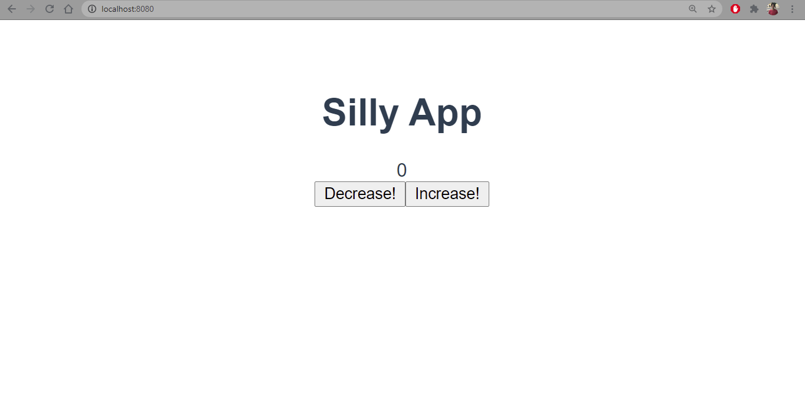

# counter

It's a vue application in its simplest forms, just wanted to get my hands dirty with how to separate my app vue to a different components, emit events, listen to events and passing data from parent components to childs and vice versa as well.

## How the app looks like

<p>
  
</p>

### live preview of the app

[https://infallible-boyd-88d212.netlify.app/](https://infallible-boyd-88d212.netlify.app/)

## Project setup

```
npm install
```

### Compiles and hot-reloads for development

```
npm run serve
```

### Compiles and minifies for production

```
npm run build
```

### Lints and fixes files

```
npm run lint
```

### Customize configuration

See [Configuration Reference](https://cli.vuejs.org/config/).
